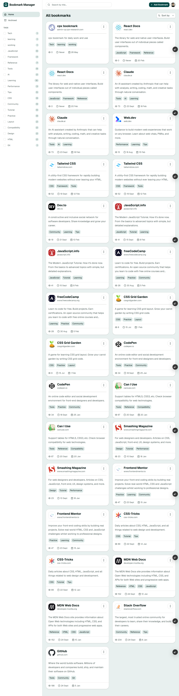
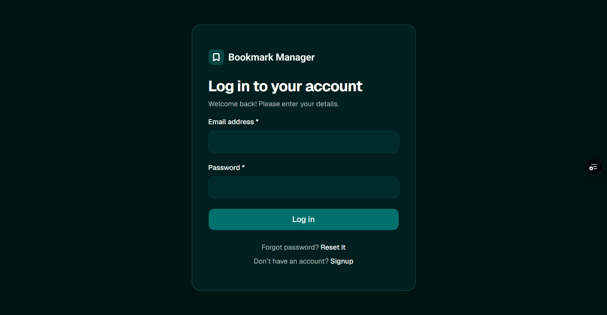
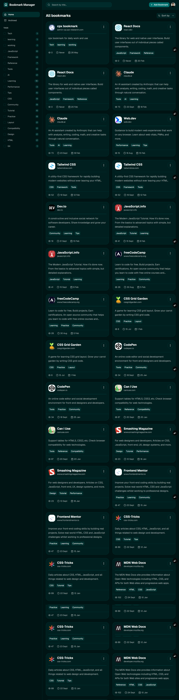

# 🔖 Bookmark Manager

A modern full-stack bookmark management application built with React, TypeScript, Tailwind CSS, Shadcn UI, and Supabase.

🌐 Live Demo: https://bookmark-manager-tx3d.vercel.app

---

## ✨ Features

- 🔐 Authentication with Supabase
- 🌓 Dark / Light mode
- 📁 Organize bookmarks
- 🗂️ Archive bookmarks
- 🔍 Fast and responsive UI
- ⚡ React Query caching
- 🛡️ Protected routes
- 🚨 Error Boundary fallback UI
- 📱 Fully responsive design

---

# 📸 Screenshots

## Home Page



---

## Login Page



---

## Dark Mode



---

## 🛠️ Tech Stack

### Frontend

- React
- TypeScript
- React Router DOM
- Tailwind CSS
- Shadcn UI
- React Query
- React Error Boundary

### Backend / Services

- Supabase
- Vercel

---

## 📦 Installation

```bash
git clone <your-repository-url>
cd bookmark-manager
npm install
```

---

## ⚙️ Environment Variables

Create a `.env` file:

```env
VITE_SUPABASE_URL=your_supabase_url
VITE_SUPABASE_ANON_KEY=your_supabase_anon_key
```

---

## 🚀 Run Locally

```bash
npm run dev
```

---

## 🏗️ Build

```bash
npm run build
```
